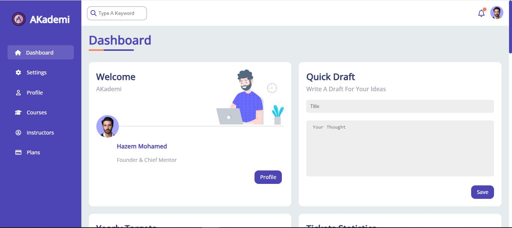

# HTML-CSS_Website-dashboard
##  Live Demo 🔗 :(https://mohamedelmtwaly.github.io/HTML-CSS_Website-dashboard/index.html/)

## 🚀 Features

- **Fully Responsive**: The template is optimized for all screen sizes (desktop, tablet, mobile).
- **Clean & Well-Organized Code**: The code is structured in a way that is easy to read, understand, and customize.
- **Customizable Styles**: Change colors, fonts, and layouts to suit your project needs.

## 🛠️ Technologies Used

- **HTML5**: For semantic structure and modern web standards.
- **CSS3**: For designing and styling the template.
- **Responsive Design**: Ensures the template looks great on all screen sizes.
- **Flexbox & Grid**: Utilized for creating modern, flexible, and efficient layouts.
- **Font Awesome Icons**: Added scalable vector icons for enhancing the visual appeal.

